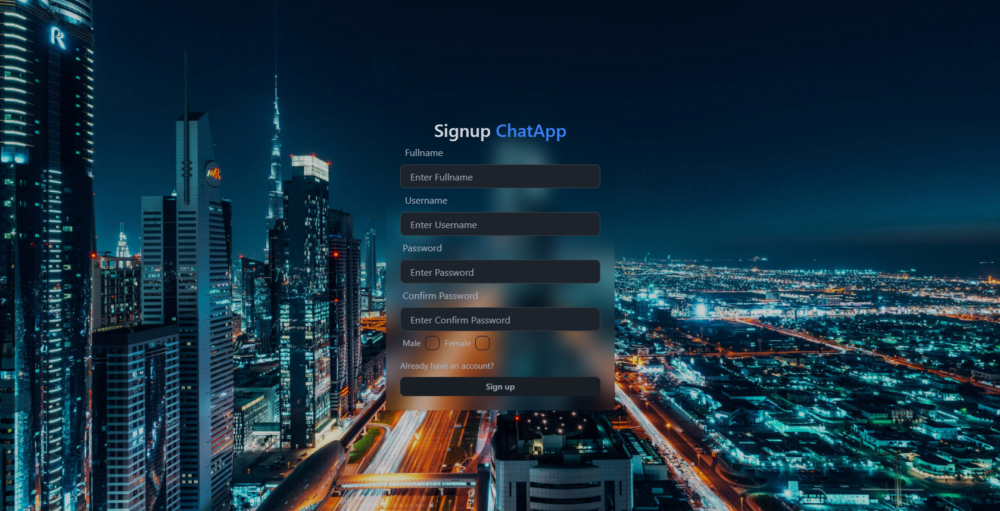
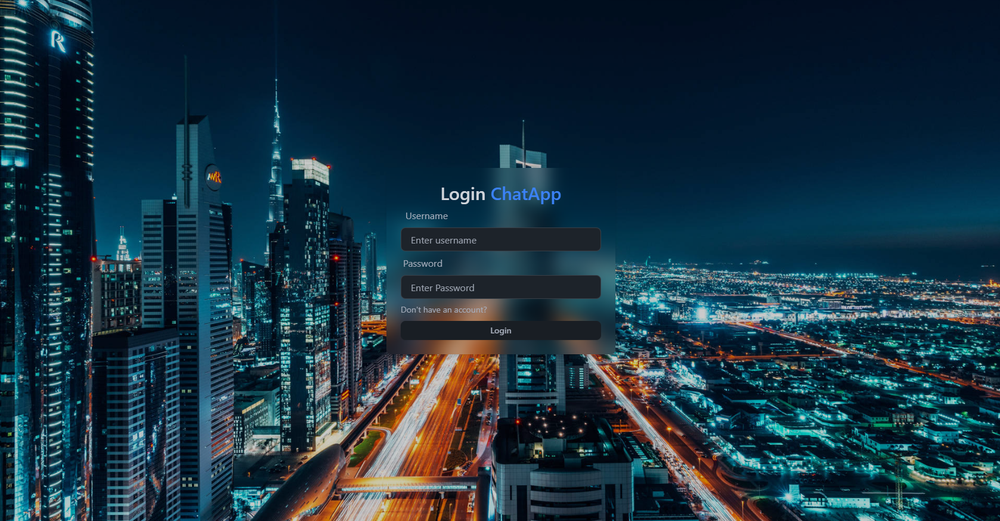
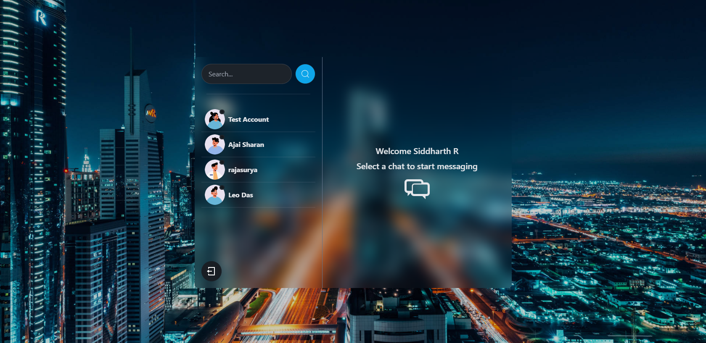

# MERN Chat Application

A real-time chat application built using the MERN (MongoDB, Express, React, Node.js) stack. This open-source chat application allows users to sign up, log in, and chat in real time with other registered users.

## Features

- **Real-time Messaging**: Instant messaging between users with live updates.
- **User Authentication**: Secure user signup and login.
- **User Profiles**: Each user has a profile with a display name and avatar.
- **Responsive Design**: Fully responsive and mobile-friendly.
- **Message Notifications**: Visual notifications for new messages.
- **Database**: Stores users, messages, and chat rooms.
- **Scalability**: Designed to handle multiple users and large chat rooms.

## Demo

[https://chat-app-mern-fkn7.onrender.com/](#) (Add the link to your live demo here if available)

## Table of Contents

- [Getting Started](#getting-started)
- [Prerequisites](#prerequisites)
- [Installation](#installation)
- [Running the Application](#running-the-application)
- [Tech Stack](#tech-stack)
- [ScreenSnaps](#screensnaps)

## Getting Started

To get a local copy up and running, follow these steps.

### Prerequisites

- [Node.js](https://nodejs.org/) and [npm](https://www.npmjs.com/) (Node Package Manager)
- [MongoDB](https://www.mongodb.com/) (a MongoDB Atlas account or local MongoDB installation)
- [Git](https://git-scm.com/)

### Installation

1. **Clone the Repository**


2. **Install Dependencies** for both client and server:
    ```bash
    npm install
    cd frontend
    npm install
    ```

3. **Environment Variables**:
   Create a `.env` file in the `server` directory and add the following environment variables:
    ```env
    MONGO_URL=your_mongodb_connection_string
    JWT_SECRET=your_jwt_secret_key
    PORT=8000
    ```

### Running the Application

1. **Start the Server**:
    ```bash
    npm run server
    ```


3. **Access the Application**:
   Open your browser and go to `http://localhost:8000`

## ScreenSnaps
1. ### Authentication pages




2. ### Chatting page
   


## Tech Stack

- **Frontend**: React, Axios, Socket.IO client
- **Backend**: Node.js, Express, Socket.IO
- **Database**: MongoDB
- **Authentication**: JSON Web Tokens (JWT)

## Contributing

Contributions are welcome! Here’s how you can help:

1. Fork the project
2. Create a branch (`git checkout -b feature/YourFeature`)
3. Commit your changes (`git commit -m 'Add new feature'`)
4. Push to the branch (`git push origin feature/YourFeature`)
5. Open a Pull Request

